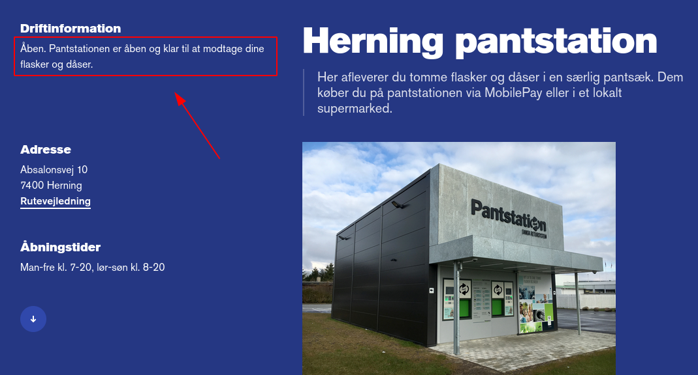

# Pantstation Notifier

En lille NodeJS app der sender en notifikation via [Pushover](https://pushover.net/) når en Pantstation ændre status.
Applikationen skal bruge 3 environment variabler, `PUSHOVER_APP_TOKEN`, `PUSHOVER_USER_KEY` og `URL`. URL'en er adressen til en specific Pantstation, fx. https://danskretursystem.dk/pantstation/herning.

Nedenstående er status teksten som bliver scrapet.

